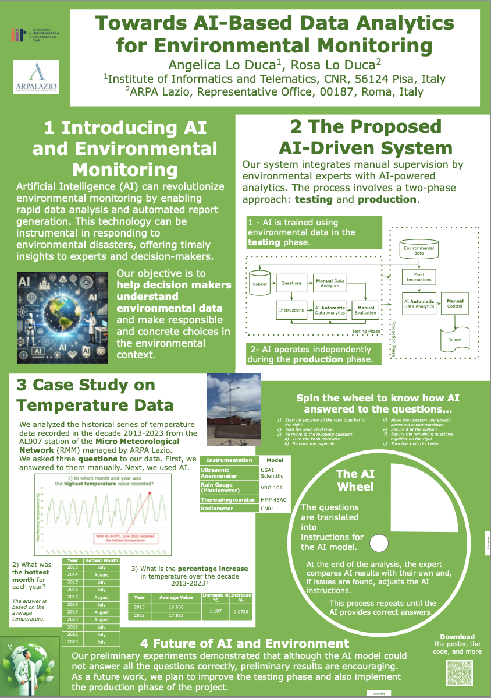
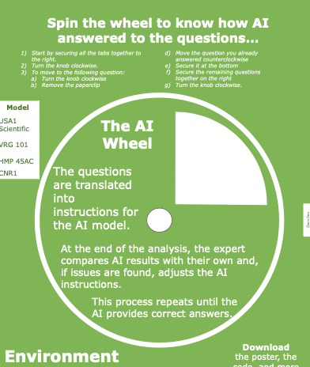

# Towards AI-Based Data Analytics for Environmental Monitoring
Angelica Lo Duca, Rosa Lo Duca

## Abstract
Environmental monitoring is essential to intervene promptly in environmental disasters or emergencies. Therefore, in the environmental field, as in other fields, it is essential to create reports quickly. In this article, we describe a possible system that uses Artificial Intelligence (AI) to automatically create environmental reports, always considering the supervision of the environmental expert. The system involves two phases, one for testing and the other for production. During the testing phase, the AI ​​system is calibrated on a subset of the available data, while during the production phase, the AI ​​system is fully operational and works on all the available data. We describe a practical case study using the temperature data provided by ARPA Lazio.  

This poster paper was presented at the [Discovery Science 2024 Conference](http://ds2024.isti.cnr.it/).

## The poster

The poster contains a three-level interactive wheel you can spin to show different scenarios. The goal of this wheel is to engage the observer actively.

You can build the wheel, too.

### Required:

* a sample holder
* adhesive tape
* a bottle cap
* two paper clips

### Procedure:
1. Cut out the white parts in the main wheel and in the various layers
2. Drill two holes in the bottle cap and insert the two tabs of the sample holder into the two holes. Secure with tape. 
3. Drill a hole in the main poster and subsequent layers. 
4. Secure the sample holder to the last level of the wheel with tape.
5. Use the paper clips as indicated on the poster to move from one level to another.

Download the [poster](Poster/PosterLoDuca.pdf).

Have fun!

